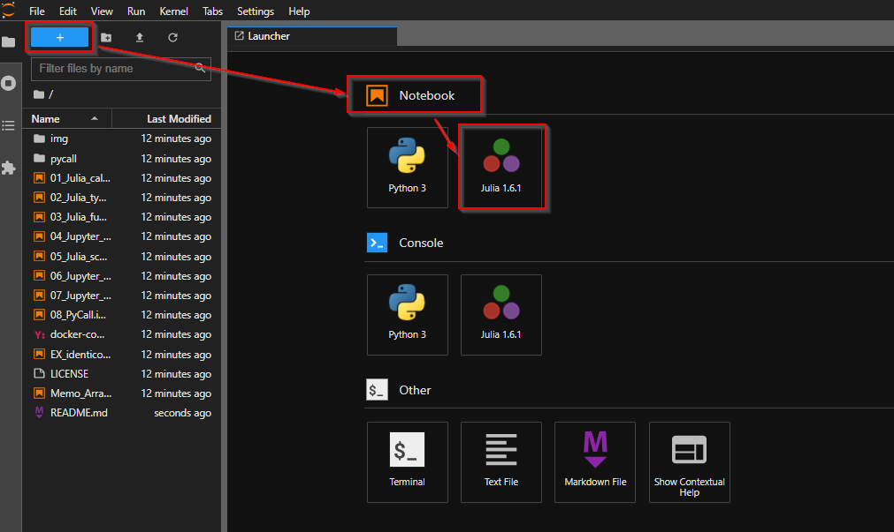

# Julia 1.6.1 on Ubuntu 20.04

## Environment

- OS: Ubuntu 20.04
- GPU: nVidia RTX 2060
- Shell: bash
- Julia: 1.6.1
    - Anaconda: 1.5.2
        - JupyterLab: 3.0.15

### Setup
```bash
# download julia-1.6.1 into ~/julua-1.6.1/
$ wget -qO- https://julialang-s3.julialang.org/bin/linux/x64/1.6/julia-1.6.1-linux-x86_64.tar.gz | tar -xzv -C ~/

# install julia binary
$ sudo ln -s ~/julia-1.6.1/julia /usr/local/bin/julia

# confirm julia version
$ julia -v
julia version 1.6.1

# install Conda.jl package
## Conda.jl: Anaconda python 環境を Julia 内に作成するパッケージ
## * 大抵の Linux 環境では最初から別に Python 環境が入っていると思われる
## * あまり既存の Python 環境を汚したくはないため、Julia からは極力 Conda.jl 内の Python 環境を使う方が良い
$ julia -e 'using Pkg; Pkg.add("Conda")'

# setup PATH to ~/.julia/conda/3/bin
$ echo 'export PATH="$PATH:$HOME/.julia/conda/3/bin"' >> ~/.bashrc
$ . ~/.bashrc

# install PyCall.jl package
## PyCall.jl: Julia から Python を使うためのパッケージ
## * Conda.jl 環境の Python (~/.julia/conda/2/bin/python) を使うように指定してインストールする
$ julia -e 'ENV["PYTHON"] = "~/.julia/conda/3/bin/python"; using Pkg; Pkg.add("PyCall")'

# install JupyterLab by Conda.jl
## JupyterLab: Jupyter Notebook の後継
## * Jupyter Notebook: ノートブック形式でデータを可視化しながらプログラミング言語（主にPython）を実行できるIDE環境
# $ conda install -y -c conda-forge jupyterlab
$ julia -e 'using Conda; Conda.add("jupyterlab"; channel="conda-forge")'

# install IJulia.jl (Jupyter kernel for Julia)
$ julia -e 'using Pkg; Pkg.add("IJulia")'

# confirm jupyter kernels
$ jupyter kernelspec list
Available kernels:
  julia-1.6    ~/.local/share/jupyter/kernels/julia-1.6
  python3      ~/.julia/conda/3/share/jupyter/kernels/python3

# launch jupyter lab
## * 実行ポート: 8888 (optional)
## * ブラウザの自動起動なし: optional
## * token不要: tokenなしにすれば http://localhost:<port>/lab に直接アクセスできる
## * Project.toml へのパス: ./
###  + --project=<Project.tomlへのパス> を指定することで対応する仮想環境で作業できるようになる
###  + 指定しない場合、デフォルトのグローバル環境で作業することになるため、環境を汚してしまうデメリットがある
> jupyter lab --port=8888 --no-browser --ServerApp.token='' --project=@.

# => JupyterLab will be opened in http://localhost:8888/lab
```



Juliaのプログラムを実行できるノートを新規作成するためには `+` > `Notbook` > `Julia 1.6.1` を選択する 
